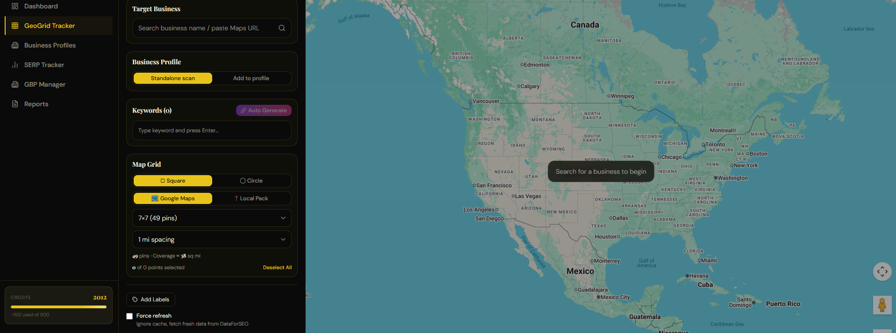
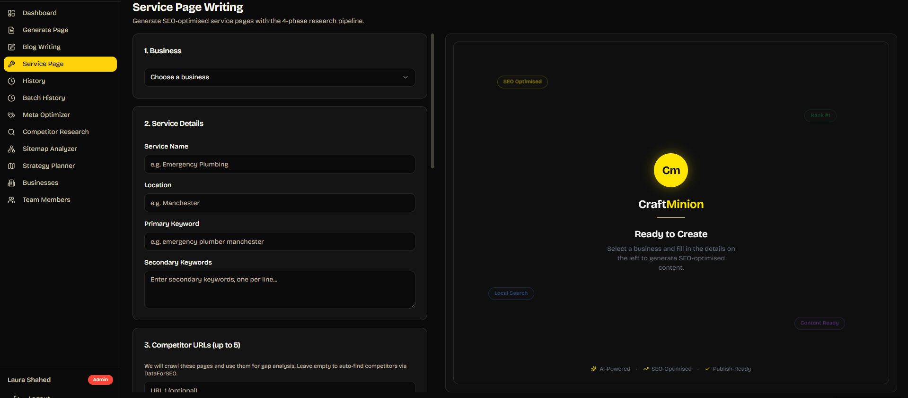
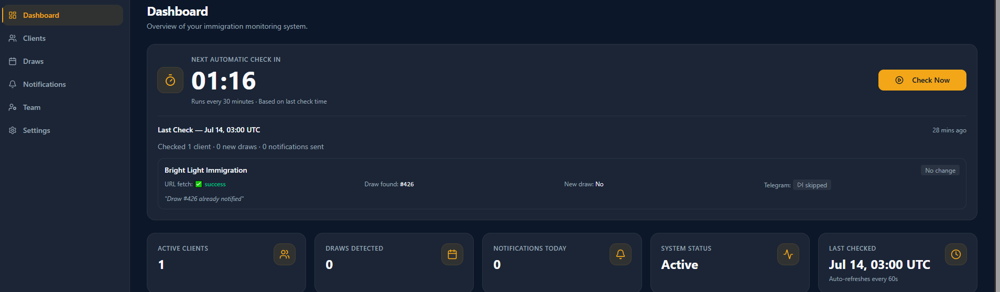

# Hi, I'm Sani 👋

### Web & Automation Engineer @ GrowMinion LLC

**Building SaaS Products • SEO Platforms • AI Automation • Modern Web Applications**

---

# 👨‍💻 About Me

I'm **Sani**, a **Web & Automation Engineer** at **GrowMinion LLC**.

I build scalable SaaS products, AI-powered automation systems, SEO platforms, and modern web applications that solve real business problems.

### 💼 What I Work On

- 🚀 SaaS Product Development
- 🤖 AI Automation & Workflow Systems
- 🌐 Modern Web Applications
- 📈 Local SEO Platforms
- ⚡ Internal Business Tools
- 🗺️ Google Maps & Local Search Technologies

---

# 🚀 Featured Products

## 🗺️ RankDominator

AI-powered Local SEO GeoGrid Rank Tracker for Google Maps.

### Key Features

- Google Maps GeoGrid Ranking
- Local Pack Tracking
- DataForSEO Integration
- Multi Business Profiles
- Keyword Tracking
- Heatmap Visualization

---

## ✍️ CraftMinion

AI-powered SEO content generation platform built for agencies and local businesses.

### Key Features

- AI Service Page Writing
- Blog Generation
- Competitor Research
- Meta Optimizer
- Sitemap Analyzer
- Strategy Planner
- SEO Content Workflow

---

## 🔔 AlertFlow

Website monitoring & automation platform for real-time notifications.

### Key Features

- Website Monitoring
- Change Detection
- Telegram Notifications
- Email Alerts
- Dashboard Analytics
- Client Management

---

# 🛠️ Tech Stack

### Frontend

### Backend

### Automation & Tools

---

# 🌱 Currently Working On

- 🚀 RankDominator
- ✍️ CraftMinion
- 🔔 AlertFlow
- 🤖 AI Automation Systems
- ⚡ SEO Internal Tools
- 🌍 Modern SaaS Platforms

---

# 📫 Connect With Me

---

### Thanks for visiting my profile! 🚀

Building scalable software, automation systems, and SEO products that create real business impact.

